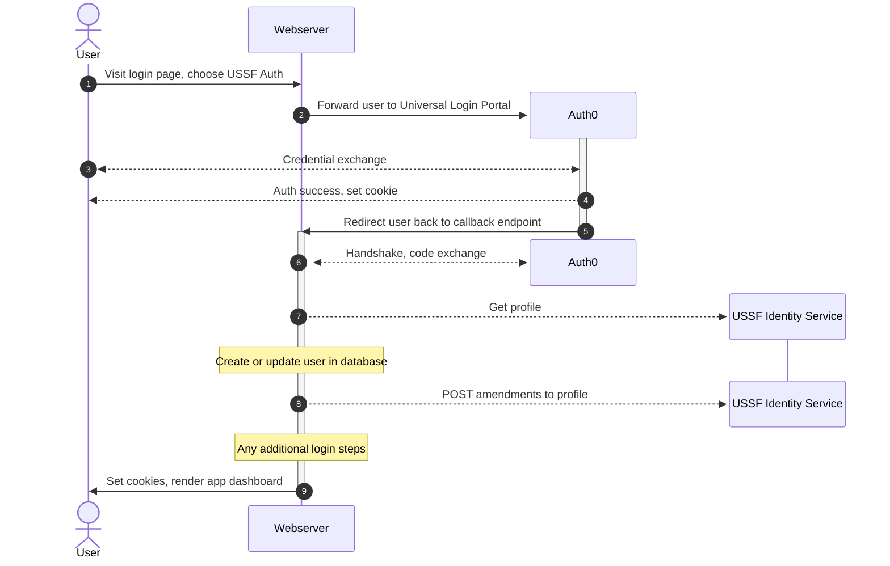

# Soccer ID - U.S. Soccer Federation Partner Authentication SDK


## Requirements

- PHP 8+
- Any PSR-18 compatible HTTP client, such as Guzzle
- Client ID & Secret from USSF
- An agreed-upon callback URL

## About

Soccer ID is an initiative by the U.S. Soccer Federation to empower partner applications. This SDK simplifies the
integration of third-party applications with USSF's identity provider (IdP), enabling seamless user authentication via
USSF’s user pool.

With this SDK, developers can quickly implement secure login functionality, allowing users of their applications to
authenticate using their USSF credentials. It abstracts the complexities of identity federation, handling authentication
flows, token validation, and user session management with minimal configuration. Whether you're building a membership
portal, a fan engagement platform, or an internal team tool, this SDK streamlines the authentication process, ensuring a
secure and consistent login experience.

## How it works

Your application will complete the expected Auth0 login flow, then will interact with USSF's Identity Service to
get or update information about the user. Afterward, you finalize the user's session, logging them into your app.

For a detailed view on all the pieces involved in this flow, see the sequence diagram below:



1. On your application's login page, provide the user with the option to "Login with USSF."
2. Direct the user to USSF's Auth0 Universal Login page.
3. The user will then be prompted to enter their credentials (email and password) if they are not already logged into
   USSF
4. Auth0 will set cookies on the user's browser, and then...
5. Redirect the user to the partner app's configured "callback URL"
6. The partner app will need to perform a "code exchange" with Auth0. On success, the user can be considered
   authenticated
7. Send a GET request to USSF's Identity Service to get the user's profile. This contains additional information about
   the user. Use info from the Auth0 session + profile to upsert the user into your app's database.
8. You _may_ provide updates/changes to the user's profile if needed.
9. Do any additional steps needed to log the user into your application and set their cookie(s).

## Quick setup

Install the SDK:

```sh
composer require ussoccerfederation/soccer-id-sdk-php
```

Install a PSR-18 HTTP client _if you don't already have one_:

```sh
composer require guzzlehttp/guzzle guzzlehttp/psr7 http-interop/http-factory-guzzle
```

Configure your environment variables, or use `.env`. See `.env.example` for a good starting point.

```dotenv
# Get these from USSF:
USSF_AUTH0_CLIENT_ID=example-client-id-from-ussf
USSF_AUTH0_CLIENT_SECRET=example-client-secret-from-ussf
USSF_AUTH0_DOMAIN=dev-41ua7lcvua0w6wte.us.auth0.com

# Create your own cookie secret. This is used to encrypt the auth0 cookie.
# This can be generated using `openssl rand -hex 32` from your shell.
USSF_AUTH0_COOKIE_SECRET=dd60d4b06b73480172f08741cb00f0c3b70d559965669a808edb1b89c0d30dd5

# Specify the schema (HTTP/HTTPS) and domain for your app.
# If blank, UssfAuth will make its best guess.
# Example: http://my-app.fakeorganization.org
APP_URL=

# This should be the route to the "callback" endpoint.
# This is where users will be directed to in your app in order to complete
# the Auth0 exchange.
USSF_AUTH0_CALLBACK_ROUTE=ussf_callback.php
```

If you are using Laravel, please jump forward to [Laravel Integration](#Laravel-Integration)

If you'd like to use `.env` files with your application and have not already included `phpdotenv`, do so now:

```shell
composer require vlucas/phpdotenv
```

Now in your application, create an instance of the `UssfAuth` client. For example:

```php
<?php

require 'vendor/autoload.php';

// Load .env - not needed if using real environment variables
(Dotenv\Dotenv::createImmutable(__DIR__))->load();


$ussfAuth = new UssfAuth(
   auth0: new Auth0Client(
       auth0Configuration: Auth0Configuration::fromEnv(), // Load from environment variables
       auth0: null, // Can specify our own Auth0 instance; leave `null` to create from `auth0Configuration`
       logger: new StdoutLogger(), // Can specify your own PSR/log-compatible logger, such as Monolog
   ),
);
```

You will use the instance of `UssfAuth` on a few different pages: when the user chooses to log in via USSF, during the
callback phase of authentication, and when logging out. You may want to bind it to a singleton or use a factory to make
it available to these pages.

Next, we need an action to associate with the user choosing to log in with USSF. You may have a button or link that
binds to `/ussf_login.php`, for example. We'll need to use our `UssfAuth` instance to initiate the login attempt:

```php
$ussfAuth->login();
```

That is enough to send the user over to Auth0 to prompt for permission and credentials. Next, we need a landing page
that Auth0 will redirect them to in order to perform a code exchange. Lets call it `/ussf_callback.php`. It will also
need access to the `UssfAuth` instance.

```php
$session = $ussfAuth->callback(function (Auth0Session $session, ?object $profile) {
    // $session will contain information related to Auth0, such as name, email, access token, etc.
    // $profile will contain additional information about the user. Data shape is configurable.

    // This is where you can sync the user's info with your database.
    
    // Remember to set any cookies or do any other session management here
    
    // You can also update the user's profile by returning an array of key-value pairs to change:
    // return [
    //   'name' => 'John Doe',
    // ];
});
```

Finally, we need to allow the user to log out. Modify your logout script to perform a logout action against the
`UssfAuth` instance if the user is logged in via this method. This may look something like:

```php
session_destroy(); // Destroy the user's session

if( $user->logged_in_via_ussf ) {
    $ussfAuth->logout('/index.php'); // Redirect them back to index.php after logout
} else {
   // Do your app's log out behaviour here
   header("Location: /index.php");
}
```

With everything in place, you should now be able to start your app and complete the full login/logout cycle using USSF
Auth.

## Laravel Integration

Laravel allows you to access environment variables via the `env()` helper, however this is only considered valid while
within the context of config files. Instead of accessing the environment variables directly when instantiating the
`UssfAuth` instance, we'll need to create a config file. Create a new file: `config/soccerid.php`

```php
<?php

return [
    'auth0' => [
        /* Get these from USSF */
        'client_id' => env('USSF_AUTH0_CLIENT_ID'),
        'client_secret' => env('USSF_AUTH0_CLIENT_SECRET'),
        'domain' => env('USSF_AUTH0_DOMAIN'),

        /* Use a long, random secret for cookie encryption */
        'cookie_secret' => env('USSF_AUTH0_COOKIE_SECRET'),

        /* The route that the user will be directed back to handle Auth0 code exchange and complete login */
        'callback_route' => env('USSF_AUTH0_CALLBACK_ROUTE', '/ussf_callback.php'),
    ],
];
```

Next, we'll create a service provider to bind our `UssfAuth` instance. Create a new file:
`Providers/SoccerIdServiceProvider.php`

```php
<?php

namespace App\Providers;

use Illuminate\Foundation\Application;
use Illuminate\Support\ServiceProvider;
use Psr\Log\LoggerInterface;
use USSoccerFederation\UssfAuthSdkPhp\Auth\Auth0Client;
use USSoccerFederation\UssfAuthSdkPhp\Auth\Auth0Configuration;
use USSoccerFederation\UssfAuthSdkPhp\Identity\IdentityClient;
use USSoccerFederation\UssfAuthSdkPhp\Identity\IdentityClientConfiguration;
use USSoccerFederation\UssfAuthSdkPhp\UssfAuth;

class SoccerIdServiceProvider extends ServiceProvider
{
    public function register(): void
    {
        //
    }

    public function boot(): void
    {
        $this->app->bind(Auth0Configuration::class, function () {
            return new Auth0Configuration(
                domain: config('soccerid.auth0.domain'),
                clientId: config('soccerid.auth0.client_id'),
                clientSecret: config('soccerid.auth0.client_secret'),
                cookieSecret: config('soccerid.auth0.cookie_secret'),
                callbackRoute: config('soccerid.auth0.callback_route'),
            );
        });

        $this->app->bind(
            UssfAuth::class,
            function (Application $app) {
                $configuration = $app->make(Auth0Configuration::class);
                $logger = $app->make(LoggerInterface::class);

                return new UssfAuth(
                    auth0: new Auth0Client(
                        auth0Configuration: $configuration,
                        logger: $logger,
                    ),
                );
            }
        );
    }
}
```

Remember to add the provider to boostrapping. For example, in Laravel 12, this is done by adding it to
`bootstrap/providers.php`:

```php
<?php

return [
    App\Providers\AppServiceProvider::class,
    App\Providers\SoccerIdServiceProvider::class, // Add this
];
```

Finally, we need to hook up routing and serving. In the example below, we will do this the easy way. Add login, logout,
and callback routes into `/routes/web.php`:

```php
Route::get('/login_ussf', function (UssfAuth $ussfAuth) {
    $ussfAuth->login();
});

Route::get('/logout_ussf', function (UssfAuth $ussfAuth) {
    session()->invalidate(); // Or whatever you need to log out a user from your app
    $ussfAuth->logout('/');
});

Route::get(config('soccerid.auth0.callback_route'), function (UssfAuth $ussfAuth) {
    $ussfAuth->callback(function (Auth0Session $session, ?object $profile) {
        session()->put('logged_in', true); // Example only; do whatever you need to actually log the user into your app

        // Update your database with information from the Auth0 session and/or USSF profile
        // Example:
        // ```php
        // $userRepository->update(['name' => $session->user['name'], 'email' => $session->user['email']]);
        // ```
    });

    redirect('/dashboard'); // Redirect user into the app. Don't keep them on callback!
});
```

This is enough to test out functionality. Start your app and visit `/login_ussf` to give it a try. Once you're ready,
move the core logic into a [Controller](https://laravel.com/docs/12.x/controllers#main-content) and configure your final
[Routing](https://laravel.com/docs/12.x/routing#main-content).